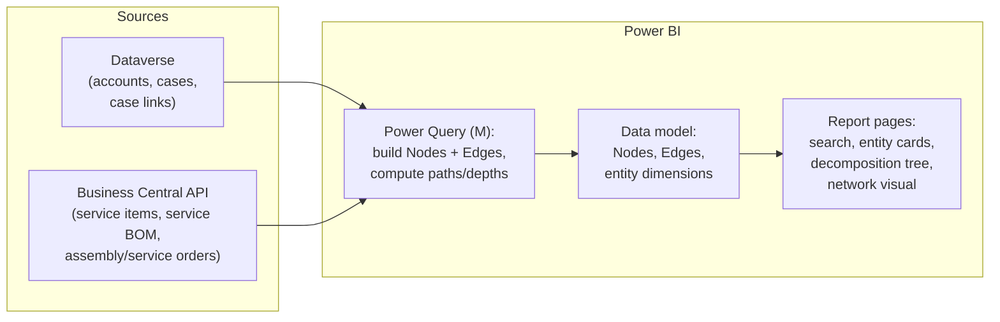

# Implementation Design: Graph Search over CE + Business Central in Power BI

Design for the unified search and navigation solution described in
[`service-process.md`](service-process.md). Target platform: **Power BI**
(chosen for minimal custom code and native connectors to both systems).

## 1. Confirmed inputs

| Question | Answer |
|---|---|
| Who lacks what | Service Desk (CE) does not see BC data; mechanics work in BC via the **Anvaigo app** and do not see CE case history |
| Account matching | **Dual-write**: the account is created in CE, then flows to BC — a shared identifier exists |
| Volumes | **471 installations last year**; each installation has ~8–10 serialized products and ~100 products in total |
| UI | **Power BI**: minimal custom code, accepts Python scripts, traversal algorithms and visualizations can live there |

## 2. Volume assessment

Per year: ~471 installations × ~100 BOM lines ≈ **47k component rows**, of
which ~4–5k serialized; plus orders and cases. Over several years the whole
graph is on the order of **10⁵ vertices** — tiny by graph standards.

Consequences:

- **materialize the full graph on every refresh** — no incremental logic,
  no graph database needed; a full rebuild takes seconds;
- all traversal computations (paths, depths, components) can be done at
  refresh time and stored as plain columns;
- any visual works without sampling.

## 3. Architecture



**Data layer.** Native connectors, no code: the **Dataverse connector**
(accounts, incidents/cases, case-to-service-item links) and the **Business
Central connector / API pages** (service items, service BOM lines, assembly
orders, service orders). Both are cloud sources — **no gateway needed** as
long as the ETL stays in M.

**Graph layer (built in Power Query).** Two central tables:

| Table | Columns |
|---|---|
| `Nodes` | `node_id`, `node_type` (Account / Branch / Machine / ServiceItem / Component / Software / SalesOrder / AssemblyOrder / ServiceOrder / Case), `label`, `source_system` (CE / BC), `serial_no`, `search_text`, `root_account_id`, `path` (materialized path to the account), `depth`, `is_orphan` |
| `Edges` | `source_id`, `target_id`, `edge_type` (owns / consists_of / linked_to / escalated_to / produced_by) |

Precomputed graph columns replace runtime traversal:

- **`path`** — the materialized path
  `Account / Branch / Machine / Installation / Component`. The ownership
  backbone is a **tree**, so the path is unique (study notes §3). For the
  tree part DAX `PATH()` / `PATHITEM()` also works if a parent-child column
  is kept.
- The extra edges that make the structure a **DAG** (case → component,
  case → service order) are kept as separate relationship tables and do not
  break the tree backbone.
- **`is_orphan`** — vertices unreachable from any account (BFS from all
  account roots at refresh time). This is a **data-quality signal**: an
  orphan means a broken CE↔BC link (e.g., a service order whose case
  reference was lost).

**Key architectural caveat about Python.** Python in **Power Query**
requires a *personal gateway* when the report is published to the service —
avoid it. Recommended split:

1. ETL and path computation — **pure M** (recursion or a self-join loop
   over ≤ 6 levels is straightforward);
2. Python only in **Python visuals** (rendered server-side, no gateway),
   or fully outside Power BI (a scheduled script landing CSV/Parquet into
   SharePoint/OneLake) if M becomes painful.

## 4. Report pages

1. **Search** — a text-search slicer over `Nodes.search_text` (serial
   number, case number, customer name, order number); a result table with
   type icons; drillthrough to the entity card. This covers "fast search"
   with zero code.
2. **Entity cards** (drillthrough pages) — the 1-hop neighborhood of a
   vertex rendered as tables:
   - *Installation card*: composition (Service BOM), case history, service
     orders, assembly order, machine/branch/account;
   - *Component card*: serial number, which installation/machine/customer,
     linked cases;
   - *Case card*: what it is linked to, escalation (service order), the
     path up to the account.
3. **Hierarchy navigation** — the built-in **Decomposition Tree** visual
   over the ownership backbone: Account → Branch → Machine → Installation →
   Component. Interactive drill-down, no code.
4. **Graph view** — the BFS neighborhood (depth 2–3) of the selected
   vertex:
   - Option A: a **network custom visual** (e.g. Network Navigator) fed by
     `Edges` filtered to the neighborhood — interactive, click to expand;
   - Option B: a **Python visual** — the slicer selection arrives as the
     input dataframe, the script runs BFS and draws the ego-network with
     matplotlib. Static but fully controllable.
   - *To verify:* availability of `networkx` in the Power BI service
     sandbox (pandas/matplotlib are guaranteed). Fallback: BFS in ~30
     lines of pure pandas, layout precomputed at ETL time.
5. **Data quality** — a small page listing `is_orphan` vertices: broken
   cross-system links surface automatically.

## 5. Graph theory actually used

| Task | Concept | Study notes |
|---|---|---|
| Neighborhood of a vertex | BFS to depth k | §4 |
| Path to the account | unique path in a tree; materialized path | §3 |
| Case/order with several parents | DAG, not a tree | §2–3 |
| Broken cross-system links | reachability / connected components | §2 |
| Search | inverted index over vertex attributes (no AI) | — |

## 6. Luxury maximum: Trimble forum layer

A separate ETL job (outside Power BI, scheduled script):

1. fetch forum threads (check the forum's ToS / availability of an API or
   RSS before scraping);
2. build a keyword index: product model numbers and problem keywords →
   thread;
3. land a `ForumThreads(model_no, title, url, tags, last_activity)` table
   next to the graph tables.

On the *Component card* and *Case card* pages a "related forum threads"
section joins by component model number — one hop from a case to relevant
discussions. Plain keyword matching, no AI.

## 7. Prototype

`prototype/` contains a dependency-free Python prototype:

- `generate_sample_data.py` — generates realistic sample extracts of both
  systems (CSV): accounts/branches (CE), cases (CE), customers, service
  items, service BOM, orders (BC) — scaled to the real volumes;
- `build_graph.py` — builds `output/nodes.csv` and `output/edges.csv`
  (the exact tables from §3, including materialized paths and orphan
  detection) and demonstrates BFS neighborhood search from the command
  line.

Usage:

```bash
python3 prototype/generate_sample_data.py   # writes prototype/data/*.csv
python3 prototype/build_graph.py            # writes prototype/output/*.csv
python3 prototype/build_graph.py --search "SN-100234"   # demo: find + BFS neighborhood
```

`output/nodes.csv` + `output/edges.csv` can be loaded into Power BI Desktop
(Get Data → Text/CSV) to try the report pages from §4 on realistic data
before touching the live systems.

## 8. Open questions

1. **Machines (excavators)** — are they modeled anywhere today (a custom
   Dataverse entity? a field on the Service Item?), or does the graph
   introduce them?
2. Which CE field(s) link a case to a service item / component — standard
   `incident` lookup or custom columns?
3. Which BC field stores the CE account id (dual-write mapping) — needed
   for the join.
4. Case volume per year (for the search index sizing — likely irrelevant
   at these scales, but good to know).
5. Does the Trimble forum offer an API/RSS, and do its terms allow
   indexing?
