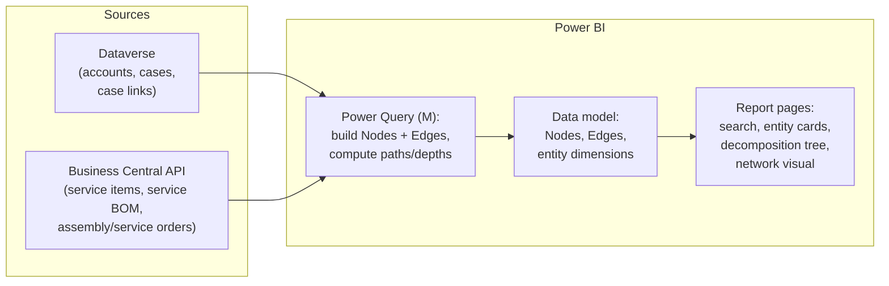

# Implementation Design: Graph Search over CE + Business Central in Power BI

Design for the unified search and navigation solution described in
[`service-process.md`](service-process.md). Target platform: **Power BI**
(chosen for minimal custom code and native connectors to both systems).

## 1. Confirmed inputs

| Question | Answer |
|---|---|
| Who lacks what | Service Desk (CE) does not see BC data; mechanics work in BC via the **Anvaigo app** and do not see CE case history |
| Account matching | **Dual-write**: the account is created in CE, then flows to BC — a shared identifier exists |
| Volumes | **471 installations last year**; each installation has ~8–10 serialized products and ~100 products in total |
| UI | **Power BI**: minimal custom code, accepts Python scripts, traversal algorithms and visualizations can live there |
| Machines (excavators) | **Not tracked today** — Dataverse has service territories, but the information is not maintained. The machine level is excluded from the core model; equipment movement tracking goes to the luxury maximum (§6) |

## 2. Volume assessment

Per year: ~471 installations × ~100 BOM lines ≈ **47k component rows**, of
which ~4–5k serialized; plus orders and cases. Over several years the whole
graph is on the order of **10⁵ vertices** — tiny by graph standards.

Consequences:

- **materialize the full graph on every refresh** — no incremental logic,
  no graph database needed; a full rebuild takes seconds;
- all traversal computations (paths, depths, components) can be done at
  refresh time and stored as plain columns;
- any visual works without sampling.

## 3. Architecture



**Data layer.** Native connectors, no code: the **Dataverse connector**
(accounts, incidents/cases, case-to-service-item links) and the **Business
Central connector / API pages** (service items, service BOM lines, assembly
orders, service orders). Both are cloud sources — **no gateway needed** as
long as the ETL stays in M.

**Graph layer (built in Power Query).** Two central tables:

| Table | Columns |
|---|---|
| `Nodes` | `node_id`, `node_type` (Account / Branch / ServiceItem / Component / Software / SalesOrder / AssemblyOrder / ServiceOrder / Case), `label`, `source_system` (CE / BC), `serial_no`, `search_text`, `root_account_id`, `path` (materialized path to the account), `depth`, `is_orphan` |
| `Edges` | `source_id`, `target_id`, `edge_type` (owns / consists_of / linked_to / escalated_to / produced_by) |

Precomputed graph columns replace runtime traversal:

- **`path`** — the materialized path
  `Account / Branch / Installation / Component`. The ownership
  backbone is a **tree**, so the path is unique (study notes §3). For the
  tree part DAX `PATH()` / `PATHITEM()` also works if a parent-child column
  is kept.
- The extra edges that make the structure a **DAG** (case → component,
  case → service order) are kept as separate relationship tables and do not
  break the tree backbone.
- **`is_orphan`** — vertices unreachable from any account (BFS from all
  account roots at refresh time). This is a **data-quality signal**: an
  orphan means a broken CE↔BC link (e.g., a service order whose case
  reference was lost).

**Key architectural caveat about Python.** Python in **Power Query**
requires a *personal gateway* when the report is published to the service —
avoid it. Recommended split:

1. ETL and path computation — **pure M** (recursion or a self-join loop
   over ≤ 6 levels is straightforward);
2. Python only in **Python visuals** (rendered server-side, no gateway),
   or fully outside Power BI (a scheduled script landing CSV/Parquet into
   SharePoint/OneLake) if M becomes painful.

## 4. Report pages

1. **Search** — a text-search slicer over `Nodes.search_text` (serial
   number, case number, customer name, order number); a result table with
   type icons; drillthrough to the entity card. This covers "fast search"
   with zero code.
2. **Entity cards** (drillthrough pages) — the 1-hop neighborhood of a
   vertex rendered as tables:
   - *Installation card*: composition (Service BOM), case history, service
     orders, assembly order, branch/account;
   - *Component card*: serial number, which installation/customer,
     linked cases;
   - *Case card*: what it is linked to, escalation (service order), the
     path up to the account.
3. **Hierarchy navigation** — the built-in **Decomposition Tree** visual
   over the ownership backbone: Account → Branch → Installation →
   Component. Interactive drill-down, no code.
4. **Graph view** — the BFS neighborhood (depth 2–3) of the selected
   vertex:
   - Option A: a **network custom visual** (e.g. Network Navigator) fed by
     `Edges` filtered to the neighborhood — interactive, click to expand;
   - Option B: a **Python visual** — the slicer selection arrives as the
     input dataframe, the script runs BFS and draws the ego-network with
     matplotlib. Static but fully controllable.
   - *To verify:* availability of `networkx` in the Power BI service
     sandbox (pandas/matplotlib are guaranteed). Fallback: BFS in ~30
     lines of pure pandas, layout precomputed at ETL time.
5. **Data quality** — a small page listing `is_orphan` vertices: broken
   cross-system links surface automatically.

## 5. Graph theory actually used

| Task | Concept | Study notes |
|---|---|---|
| Neighborhood of a vertex | BFS to depth k | §4 |
| Path to the account | unique path in a tree; materialized path | §3 |
| Case/order with several parents | DAG, not a tree | §2–3 |
| Broken cross-system links | reachability / connected components | §2 |
| Search | inverted index over vertex attributes (no AI) | — |

## 6. Luxury maximum

### 6.1. Trimble forum layer

A separate ETL job (outside Power BI, scheduled script):

1. fetch forum threads (check the forum's ToS / availability of an API or
   RSS before scraping);
2. build a keyword index: product model numbers and problem keywords →
   thread;
3. land a `ForumThreads(model_no, title, url, tags, last_activity)` table
   next to the graph tables.

On the *Component card* and *Case card* pages a "related forum threads"
section joins by component model number — one hop from a case to relevant
discussions. Plain keyword matching, no AI.

### 6.2. Equipment movement tracker

What the customer does in the field cannot be observed directly, but
movements of serialized equipment between installations can be *recorded*
without breaking the BC BOM structure. The graph gives a natural design:

- the **component vertex is identified by its serial number** and is
  stable — it never disappears when equipment moves;
- the link "component is part of installation" becomes a **dated
  (temporal) edge**: `InstalledIn(serial_no, service_item_no, valid_from,
  valid_to)`;
- when a receiver moves from installation A to installation B, the old
  edge gets `valid_to` filled and a new edge to B is created. **The BC
  Service BOM of each installation stays untouched** — the tracker is an
  overlay table, not a BOM rewrite;
- the current composition of an installation = edges with empty
  `valid_to`; the **history of a serial number** = its edges ordered by
  date (a path through time); "as-of" queries (what was installed on date
  X) = filtering edges by the date interval.

Sources of movement events: service orders where a mechanic swaps
hardware (captured in the Anvaigo app), or a manual entry form
(a small Power Apps form writing to Dataverse would do). In Power BI the
tracker adds a "movement history" section to the *Component card* and a
composition-on-date slicer to the *Installation card*. If machines are
ever tracked (service territories or a custom entity), they slot into the
same pattern as one more level of dated edges.

## 7. User experience: navigation and access

### 7.1. How users navigate the graph (friendly and fast)

The key UX decision: **users should not read a graph drawing — they should
jump from entity to entity**. A force-directed "hairball" of 50k vertices
is neither friendly nor fast. The navigation model:

1. **Search-first**: the landing page is a search box (search slicer).
   The user types a serial number, case number or customer name and gets
   a short result list with type icons. One click — the entity card.
2. **Entity cards as graph vertices**: each card (installation,
   component, case, order, account) shows the vertex's attributes and its
   **1-hop neighborhood as clickable tables** (drillthrough). "Moving
   along an edge" = one click on a related row. Every hop is a filtered
   in-memory query — instant at these volumes.
3. **Breadcrumb = materialized path**: the precomputed
   `Account / Branch / Installation / Component` path is shown on every
   card as clickable levels — the user always sees where they are and can
   jump up the tree (the unique-path property of the tree backbone).
4. **Decomposition Tree** for top-down exploration ("what does this
   customer have?") — the built-in interactive drill-down visual.
5. **Ego-network picture only on demand**: a small graph drawing (BFS
   depth 2 around the selected vertex, ~20–100 vertices) on the entity
   card — a network custom visual or a Python visual. It is an
   *illustration* of the neighborhood, not the primary navigation.

This mirrors how graph databases build their UIs (Neo4j Bloom and
similar): search → vertex card → expand neighbors — never "show the whole
graph".

### 7.2. How to give users view access

- **Publish** the report to a Power BI **workspace**, distribute as a
  **Power BI App** to two Entra ID security groups: Service Desk and
  mechanics. Users get a clean read-only app, not workspace access.
- **Licensing** (the real question of "view access"): viewers need
  Power BI **Pro** licenses, *or* the workspace sits on **Premium/Fabric
  capacity** (F64+) and then viewers use free licenses. For a handful of
  Service Desk agents Pro-per-user is cheapest; count the mechanics before
  choosing.
- **Where users already live**:
  - Service Desk works in CE → **embed the report into the model-driven
    app** (Power BI embedded system dashboard or a report on the Case
    form) — agents never leave CE, and the report can be pre-filtered by
    the open case;
  - mechanics work in the Anvaigo app on mobile — see §7.3, this case
    deserves its own decision.
- **Row-level security (RLS)** is available if some group must see only
  its slice (e.g., by territory), but for internal service data it is
  likely unnecessary — simpler to skip it.
- **Freshness**: scheduled refresh (e.g., every 2–4 hours; Pro allows 8/day,
  capacity up to 48/day). Both sources are cloud — no gateway.

### 7.3. Mechanics on phones (Anvaigo)

Mechanics work on mobile through the Anvaigo app on top of BC. Their
information need is narrow and predictable: *"the history of the
installation / component I am standing next to"* — they do not need
free-form graph exploration. Three options, cheapest-friction first:

1. **Bring the CE data into BC instead of bringing mechanics into
   Power BI (recommended start).** Sync a compact case summary from CE
   into BC (a small custom table: case number, title, status, created/
   closed dates, resolution notes, linked service item / BOM line) via
   Power Automate or a Logic App on a schedule. Expose it in Anvaigo as a
   related list on the Service Order / Service Item form. Result:
   mechanics see the case history **inside the app they already use** —
   no new app, no Power BI licenses for them, works with Anvaigo's
   offline sync like any other BC data. This solves the actual mechanics'
   problem ("cannot see CE case history") head-on.
2. **Deep links into the Power BI mobile app.** Mechanics install the
   Power BI mobile app and sign in with their existing Entra ID account
   (the same one Anvaigo/BC uses). A URL field or action on the service
   order in Anvaigo opens the report pre-filtered to the serial number
   (`?filter=Nodes/serial_no eq 'SN-...'`) — `app.powerbi.com` links open
   in the mobile app when installed. Requires a viewer license per
   mechanic (Pro, or free on Fabric capacity) and **mobile-layout report
   pages** (portrait-optimized entity cards). Good as a second step for
   mechanics who want the full picture.
3. **Webview inside Anvaigo.** Only if Anvaigo supports embedding web
   pages / opening an in-app browser with Entra ID sign-in — to verify
   with the Anvaigo documentation or partner. Even then, interactive
   Power BI auth inside a webview is often fragile on mobile; option 2 is
   usually the more robust variant of the same idea. (Never use
   publish-to-web "anyone with the link" for this data.)

Recommendation: **option 1 now, option 2 as an opt-in later.** The graph
report in Power BI remains the tool for Service Desk and office roles;
mechanics get the narrow slice they need inside Anvaigo.

## 8. Prototype

`prototype/` contains a dependency-free Python prototype:

- `generate_sample_data.py` — generates realistic sample extracts of both
  systems (CSV): accounts/branches (CE), cases (CE), customers, service
  items, service BOM, orders (BC) — scaled to the real volumes;
- `build_graph.py` — builds `output/nodes.csv` and `output/edges.csv`
  (the exact tables from §3, including materialized paths and orphan
  detection) and demonstrates BFS neighborhood search from the command
  line.

Usage:

```bash
python3 prototype/generate_sample_data.py   # writes prototype/data/*.csv
python3 prototype/build_graph.py            # writes prototype/output/*.csv
python3 prototype/build_graph.py --search "SN-100234"   # demo: find + BFS neighborhood
```

`output/nodes.csv` + `output/edges.csv` can be loaded into Power BI Desktop
(Get Data → Text/CSV) to try the report pages from §4 on realistic data
before touching the live systems.

## 9. Open questions

1. ~~Machines (excavators) — are they modeled anywhere today?~~
   **Answered:** not tracked (service territories exist in Dataverse but
   are not maintained). Machine level excluded from the core model;
   equipment movement tracking moved to the luxury maximum (§6.2).
2. Which CE field(s) link a case to a service item / component — standard
   `incident` lookup or custom columns?
3. Which BC field stores the CE account id (dual-write mapping) — needed
   for the join.
4. Case volume per year (for the search index sizing — likely irrelevant
   at these scales, but good to know).
5. Does the Trimble forum offer an API/RSS, and do its terms allow
   indexing?
6. Viewer licensing: how many mechanics need access (Pro per user vs
   capacity)? Can the Anvaigo app open external URLs / embed a webview
   (for deep links into the report)? See §7.3 for the options.
7. For the case-summary sync into BC (§7.3, option 1): which fields do
   mechanics actually need from a case, and is Power Automate available
   in the tenant?
