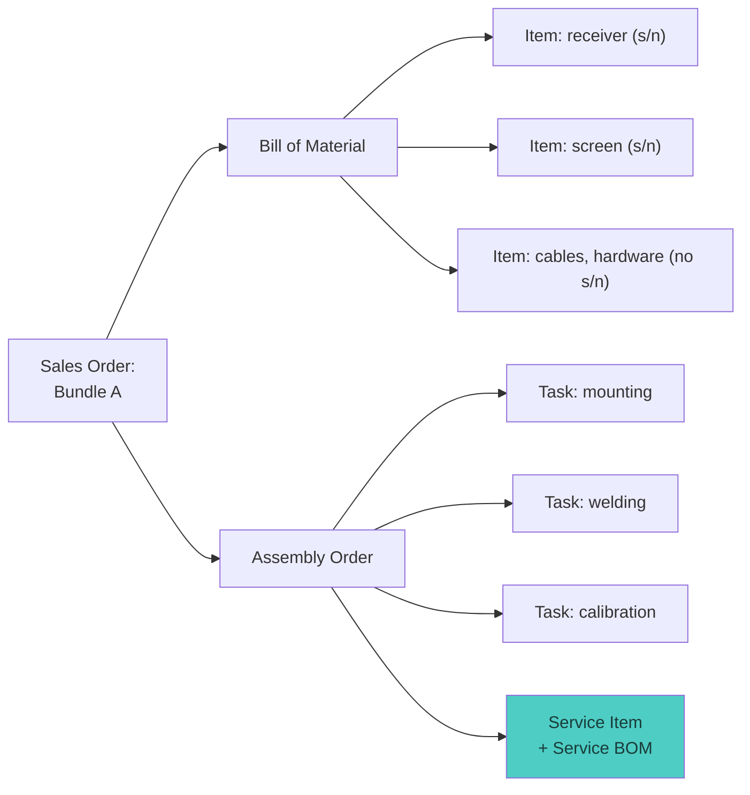
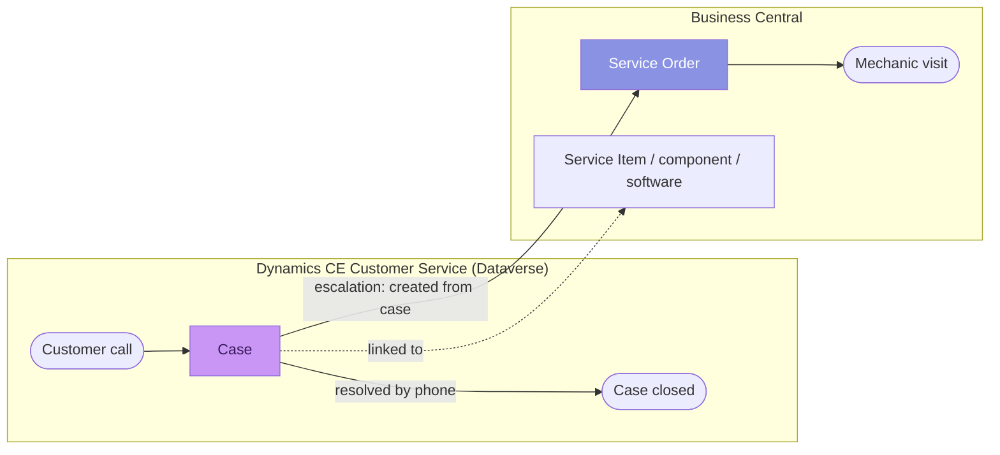
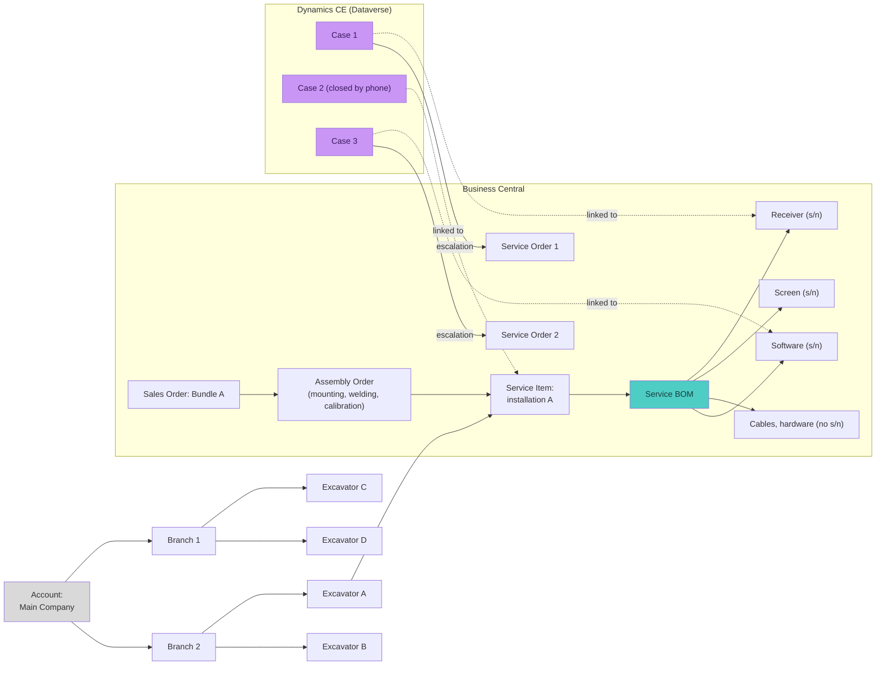

# Equipment and Service Information Process

Description of the sales, installation and service process for Trimble
positioning equipment for construction machinery, and of how the data of
this process is spread across systems. This document is the basis for
designing a graph-based search and navigation model (see "Problem and
goal").

## 1. Context

The company sells Trimble positioning equipment for construction machinery
(excavators and similar) and provides service for it.

**Customer structure:**

- **Account** — the customer's main company;
- an account may have several **branches (subsidiaries)**;
- each branch owns several **machines** (excavators etc.);
- Trimble equipment mounted on a machine is an **installation**.

Either the main company or a branch requests the sale and installation.

**Systems:**

| System | Role | Data |
|---|---|---|
| **Business Central (BC)** | ERP: sales, assembly, service orders | Sales Order, Bundle, Bill of Material, Item, Assembly Order, Service Item, Service Order |
| **Dynamics CE Customer Service (Dataverse)** | Service Desk: customer requests | Account, Contact, Case |

## 2. Sales and installation process (Business Central)

1. A **Sales Order** is created for **Bundle A** — an equipment kit.
2. The Bundle has a **Bill of Material (BOM)** — a list of components
   (**Items**):
   - **serialized** — receivers, screens, controllers;
   - **non-serialized** — cables, mounting hardware.
3. An **Assembly Order** is created for the Bundle. Assembly consists of
   three work tasks for the mechanics:
   - **mounting**;
   - **welding**;
   - **calibration**.
4. The result of assembly is a **Service Item** with a **Service Bill of
   Material**: the accounting unit "installation on a specific machine"
   with the list of actually installed components. From this point the
   service lifecycle begins.

## 3. Service process (CE + BC)

1. The customer calls support (**Service Desk**).
2. A **Case** is created in **MS Dynamics CE Customer Service**. Two
   scenarios:
   - **resolved by phone** — the agent helps, the case is closed;
   - **escalation** — a mechanic visit is needed: a **Service Order in BC**
     is created from the CE case, and the company dispatches a mechanic.
3. A case can be linked to:
   - the **installation** as a whole (Service Item);
   - a **component** inside it (a Service BOM line);
   - **software** (software has a serial number too).

## 4. End-to-end data structure (refined diagram)

The original mind map, refined: machines under branches, the sales and
assembly orders as the source of the Service Item, the split between
serialized and non-serialized components, software as a serialized
component, and system boundaries.

Differences from the original picture:

- a **machine** level (excavator) is added between the branch and the
  installation: otherwise the case "equipment was removed from one machine
  and mounted on another" cannot be tracked;
- the **Service Item is produced by the Assembly Order** rather than
  hanging off the installation by itself — the chain
  "sale → assembly → serviceable object" is visible;
- "Initial Service Order (Welding, Mounting, Calibration)" from the picture
  is the **Assembly Order** with three tasks (BC terminology);
- **software is added as a serialized component** — cases can be linked to
  it as well;
- a Service Order is created **from a case** (escalation), not directly
  under the installation; the "case → service order" edge crosses the
  system boundary — this is exactly where visibility is lost.

## 5. Problem and goal

**Problem:** the data of a single process is split between two systems.
The Service Desk (CE) cannot see BC data: installation composition, serial
numbers, assembly history and service orders. Mechanics (BC) cannot see
the case history and correspondence in CE. The end-to-end question "what
equipment does this customer have and what happened to it" requires manual
search in two systems.

**Goal:** a single **graph** on top of Dataverse and Business Central for
fast search and navigation — no AI, just graph theory fundamentals:

- **vertices** — typed entities: Account, branch, machine, Service Item,
  serialized component, software, Sales/Assembly/Service Order, Case;
- **edges** — relations between them (ownership, composition, linking,
  escalation);
- the structure is a **DAG** (directed acyclic graph), close to a tree but
  with vertices that have several parents (a Service Order is linked both
  to a case and to a Service Item);
- **search** — find a vertex by attribute (serial number, case number,
  customer name) and show its **neighborhood**: graph traversal (BFS) to a
  given depth in both directions;
- **navigation** — interactive visualization: expanding a vertex's
  neighbors, the path up to the root (account), filtering by vertex type
  and by source system.

**Luxury maximum:** an index of the Trimble forum as an extra layer —
"document" vertices (forum threads) connected by edges to component models
and problem types, so that the Service Desk can jump from a case to the
relevant discussions in one hop.

## 6. Open questions for the implementation stage

1. Where does the graph live: built on the fly from both systems' APIs, or
   materialized (periodic sync into a separate store)?
2. Matching keys: how are the CE Account and the BC Customer related
   (shared identifier? Dataverse virtual tables? Dual-write?).
3. Where does the UI live: a model-driven app in CE, a standalone web app,
   Power BI?
5. Volumes: how many accounts/installations/cases — this affects the
   "on the fly vs materialized" choice and the visualization approach.
