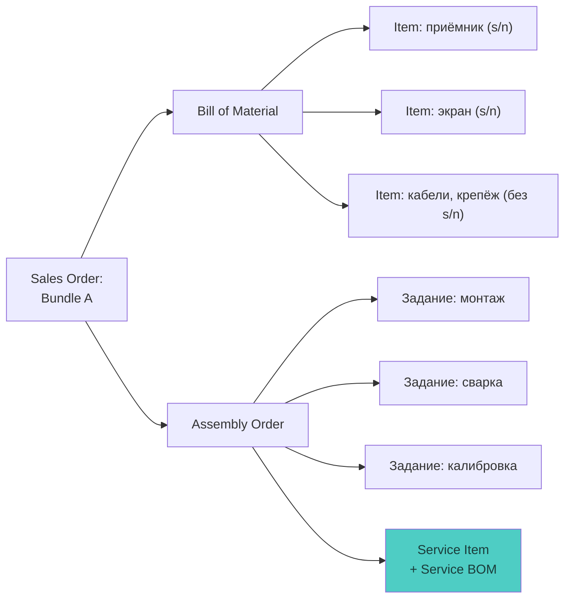
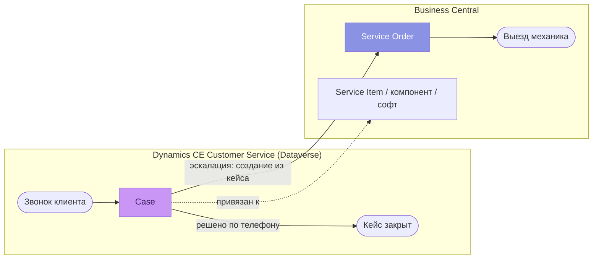
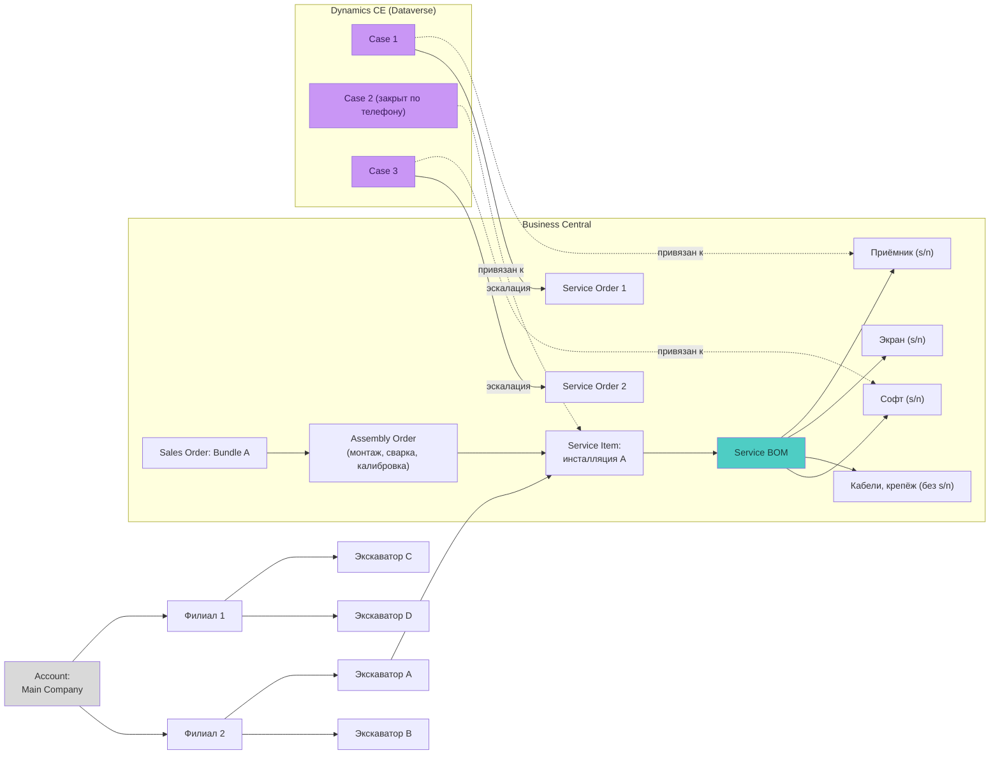

# Процесс организации информации об оборудовании и сервисе

Описание процесса продажи, монтажа и обслуживания оборудования Trimble для
позиционирования строительной техники, и того, как данные об этом процессе
распределены между системами. Документ — основа для проектирования
графовой модели поиска и навигации (см. раздел «Проблема и цель»).

## 1. Контекст

Компания продаёт оборудование Trimble для позиционирования строительной
техники (экскаваторы и подобная техника) и занимается его обслуживанием.

**Структура клиента:**

- **Аккаунт (Account)** — головная компания клиента;
- у аккаунта может быть несколько **филиалов**;
- у каждого филиала — несколько единиц **техники** (экскаваторы и т.п.);
- на технику устанавливается оборудование Trimble — **инсталляция**.

За продажу и установку обращается либо головная компания, либо филиал.

**Системы:**

| Система | Роль | Данные |
|---|---|---|
| **Business Central (BC)** | ERP: продажи, сборка, сервисные заказы | Sales Order, Bundle, Bill of Material, Item, Assembly Order, Service Item, Service Order |
| **Dynamics CE Customer Service (Dataverse)** | Service Desk: обращения клиентов | Account, Contact, Case |

## 2. Процесс продажи и монтажа (Business Central)

1. Создаётся **заказ на продажу (Sales Order)** на **Bundle A** — комплект
   оборудования.
2. У Bundle есть **Bill of Material (BOM)** — список компонентов (**Items**):
   - **с серийными номерами** — приёмники, экраны, контроллеры;
   - **без серийных номеров** — кабели, крепёж.
3. По Bundle создаётся **заказ на сборку (Assembly Order)**. Сборка — это
   три рабочих задания для механиков:
   - **монтаж (Mounting)**;
   - **сварка (Welding)**;
   - **калибровка (Calibration)**.
4. Результат сборки — **Service Item** с **Service Bill of Material**:
   учётная единица «инсталляция на конкретной машине» со списком фактически
   установленных компонентов. С этого момента начинается жизненный цикл
   обслуживания.

## 3. Процесс обслуживания (CE + BC)

1. Клиент звонит в техподдержку (**Service Desk**).
2. В **MS Dynamics CE Customer Service** создаётся **Case**. Два сценария:
   - **решение по телефону** — специалист помогает, кейс закрывается;
   - **эскалация** — нужен выезд механика: из кейса в CE создаётся
     **Service Order в BC**, компания отправляет механика.
3. Кейс может быть привязан:
   - к **инсталляции** целиком (Service Item);
   - к **компоненту** внутри неё (позиция Service BOM);
   - к **программному обеспечению** (у софта тоже есть серийный номер).

## 4. Сквозная структура данных (доработанная схема)

Исходная ментальная карта, доработанная: добавлены техника у филиалов, заказ
на продажу и сборку как источник Service Item, разделение компонентов
с s/n и без, софт как компонент с серийником, и границы систем.

Отличия от исходной картинки:

- между филиалом и инсталляцией добавлен уровень **техники** (экскаватор):
  кейс «оборудование сняли с одной машины и поставили на другую» иначе
  не отследить;
- **Service Item порождается заказом на сборку**, а не висит на инсталляции
  сам по себе — видна связь «продажа → сборка → обслуживаемый объект»;
- «Initial Service Order (Welding, Mounting, Calibration)» с картинки — это
  **Assembly Order** с тремя заданиями (терминология BC);
- добавлен **софт как компонент с серийным номером** — к нему тоже
  привязываются кейсы;
- Service Order создаётся **из кейса** (эскалация), а не напрямую у
  инсталляции; связь «кейс → сервисный заказ» пересекает границу систем —
  именно здесь теряется видимость.

## 5. Проблема и цель

**Проблема:** данные одного процесса разорваны между двумя системами.
Service Desk (CE) не видит данных BC: состав инсталляции, серийные номера,
историю сборки и сервисных заказов. Механики (BC) не видят историю
обращений и переписку по кейсам в CE. Сквозной вопрос «что за оборудование
у этого клиента и что с ним происходило» требует ручного поиска в двух
системах.

**Цель:** единый **граф** поверх Dataverse и Business Central для быстрого
поиска и навигации — без внедрения ИИ, на основах теории графов:

- **вершины** — типизированные сущности: Account, филиал, техника,
  Service Item, компонент (s/n), софт, Sales/Assembly/Service Order, Case;
- **рёбра** — связи между ними (владение, состав, привязка, эскалация);
- структура — **DAG** (направленный ациклический граф), близкий к дереву,
  но с вершинами, имеющими несколько родителей (Service Order связан и с
  кейсом, и с Service Item);
- **поиск** — найти вершину по атрибуту (серийный номер, номер кейса,
  название клиента) и показать её **окрестность**: обход графа (BFS) на
  заданную глубину в обе стороны;
- **навигация** — интерактивная визуализация: раскрытие соседей вершины,
  путь до корня (аккаунта), фильтр по типам вершин и по системе-источнику.

**Роскошный максимум:** индекс форума Trimble как дополнительный слой —
вершины-«документы» (темы форума), связанные рёбрами с моделями компонентов
и типами проблем, чтобы Service Desk из кейса за один переход попадал в
релевантные обсуждения.

## 6. Открытые вопросы к этапу реализации

1. Уточнить: «механики не видят информацию в BC» — вероятно, имелось в виду,
   что механики не видят информацию **в CE** (историю кейса)? От этого
   зависит, кому какой срез графа показывать.
2. Где хранить граф: строить на лету из API обеих систем, или
   материализовать (периодическая синхронизация в отдельное хранилище)?
3. Ключи соответствия: чем связаны Account в CE и Customer в BC
   (общий идентификатор? Dataverse virtual tables? Dual-write?).
4. Где живёт интерфейс: model-driven app в CE, отдельное веб-приложение,
   Power BI?
5. Объёмы: сколько аккаунтов/инсталляций/кейсов — влияет на выбор
   «на лету vs материализация» и на способ визуализации.
